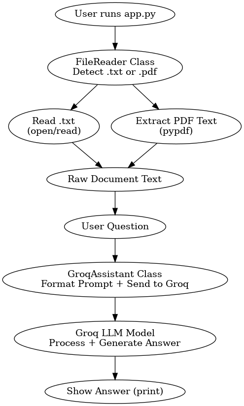
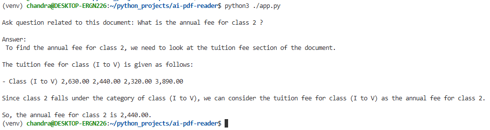
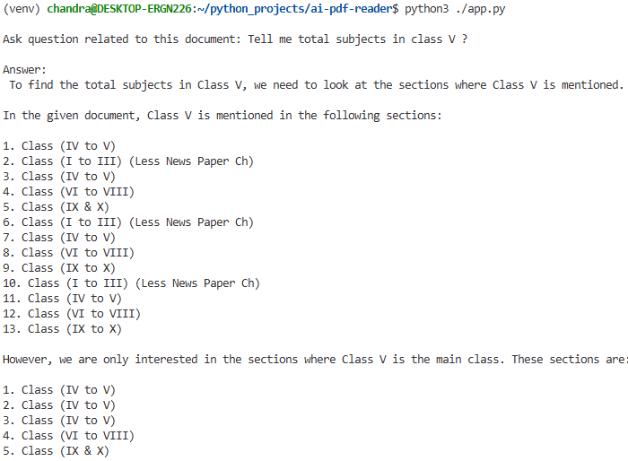

# local AI assistant
### This is a simple project that reads **text or PDF files** and answers your questions.  
---

How to setup and run the Project? Follow the steps below:

```bash
python3 -m venv venv
source venv/bin/activate

pip install -r requirements.txt
python app.py
```

---

### Sample Questions You ma can ask

After the PDF/text is loaded, you can ask questions like:

- **What is the annual fee for class 2 ?**
- **Tell me total subjects in each class ?**
---

### Notes

- Store your PDF or text file inside the `data/` folder.
- Make sure you add your `GROQ_API_KEY` in a `.env` file.
```
GROQ_API_KEY=your_api_key_here
MODEL_NAME=model_name
```


---

### Requirements

Your `requirements.txt` must contain:

```
langchain
langchain-core
langchain-groq
python-dotenv
pypdf
```

### Execution flow

<p align="center">
  
</p>

---
### Test case screenshots

<p align="left">
  
</p>
<p align="left">
  
</p>

---
